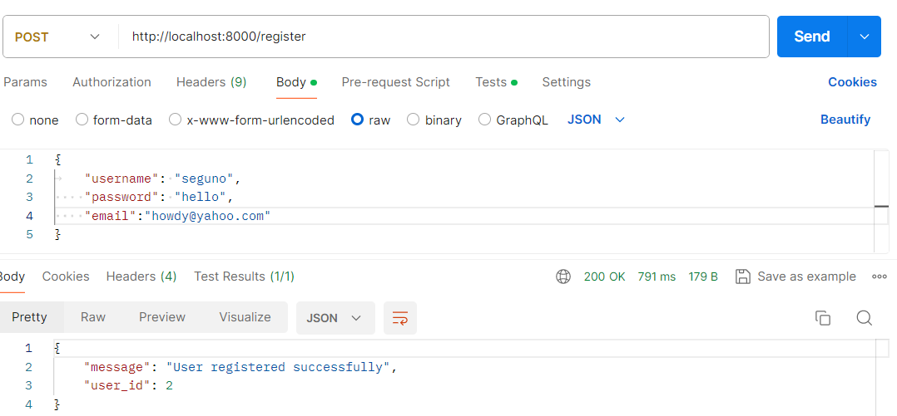
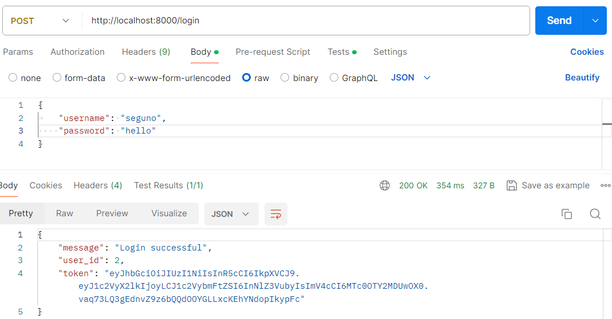
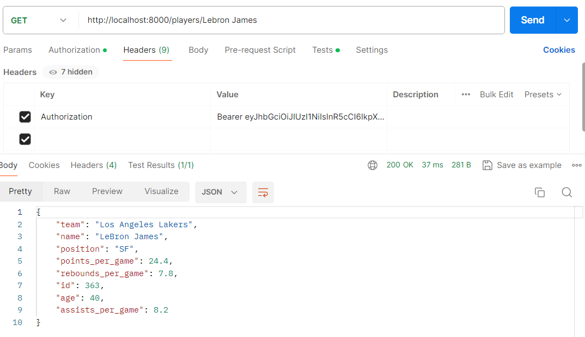

# NBA-API

A secure RESTful API for the National Basketball Association (NBA), built with FastAPI and SQLAlchemy. This API provides player information, statistics, user authentication, and querying capabilities for all active NBA players.

---

## Features

- **User Registration & Login** with password hashing and JWT authentication
- **Protected Endpoints** for player and team data
- **Queries**:  
  - Get player by name  
  - List players by position  
  - Get top players by stat  
  - List all teams and team rosters
- **CSV Import** for bulk player data
- **Web Scraper** for collecting player information and stats, writing them to a CSV file for database import
- **Environment-based configuration** (using `.env`)

---

## Tech Stack

- **Backend:** FastAPI, SQLAlchemy
- **Database:** PostgreSQL (configurable)
- **Authentication:** JWT (PyJWT)
- **Password Hashing:** passlib
- **Environment Management:** python-dotenv

---

## Setup

1. **Clone the repository**
   ```sh
   git clone https://github.com/yourusername/NBA-API.git
   cd NBA-API
   ```

2. **Create and activate a virtual environment**
   ```sh
   python3 -m venv venv
   source venv/bin/activate
   ```

3. **Install dependencies**
   ```sh
   pip install -r requirements.txt
   ```

4. **Configure environment variables**  
   Create a `.env` file in the project root.  
   Set `DATABASE_URL` to match your own database instance and credentials:
   ```
   DATABASE_URL=postgresql://<your_db_user>:<your_db_password>@localhost/<your_db_name>
   SECRET_KEY=your_secret_key
   ```
   - If you are using a **cloud-hosted database**, copy the full `DATABASE_URL` provided by your cloud provider and paste it here.

5. **Scrape NBA Player Data**  
   Run the web scraper to collect player information and stats from the web and save them to a CSV file:
   ```sh
   python test_scrap.py
   ```
   This will generate a CSV file (e.g., `players.csv`) containing the latest player data.

6. **Import Players into the Database**  
   Use the import script to read the CSV file and populate the database:
   ```sh
   python import_players.py
   ```
   This will add all scraped players to your database.

7. **Initialize the database schema**  
   Run the following command to create the tables in your database (if not already created):
   ```sh
   python models.py
   ```
   This will create all necessary tables as defined in your models.

8. **Start the API server**
   ```sh
   uvicorn main:app --reload
   ```

---

**Summary:**  
1. Scrape player data  
2. Import CSV to database  
3. Initialize schema (if needed)  
4. Start API server and use endpoints


## API Endpoints

### **Authentication**
- `POST /register` — Register a new user
- `POST /login` — Login and receive a JWT token

### **Players**
- `GET /players` — List all players (protected)
- `GET /players/{player_name}` — Get player by name (protected)
- `GET /players/position/{position}` — List players by position (protected)
- `GET /players/top/{number}/{stat}` — Top N players by stat (protected)

### **Teams**
- `GET /teams` — List all teams (protected)
- `GET /teams/{team_name}/players` — List players on a team (protected)

---

## Usage

- Use [Postman](https://www.postman.com/) or `curl` to interact with the API.
- Authenticate by including the JWT token in the `Authorization` header:
  ```
  Authorization: Bearer <your_token>
  ```

---

## Example: Register Endpoint in Postman

Below is an example of a successful registration using the `/register` endpoint in Postman:



## Example: Login Endpoint in Postman

Below is an example of a successful registration using the `/login` endpoint in Postman:



## Example: Get Player By Name Endpoint in Postman

Below is an example of a successful registration using the `/players/{player_name}` endpoint in Postman:




## Development

- Add new endpoints in `main.py`
- Define models in `models.py`
- Configure database in `database.py`
- Use `import_players.py` for bulk CSV import

---

## License

MIT License

---

## Contributing

Pull requests are welcome! For major changes, please open an issue first to discuss what you would like to change.

---

## Contact

For questions or support, open an issue or contact by email at [segunoluwole30@gmail.com].
